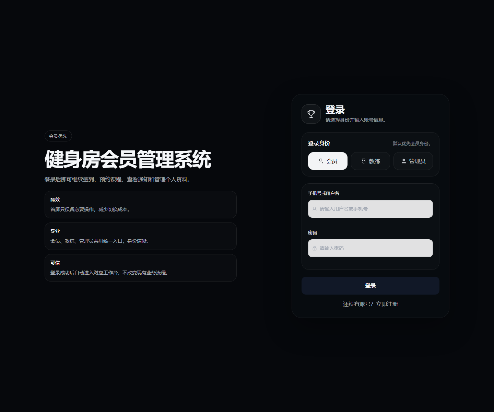
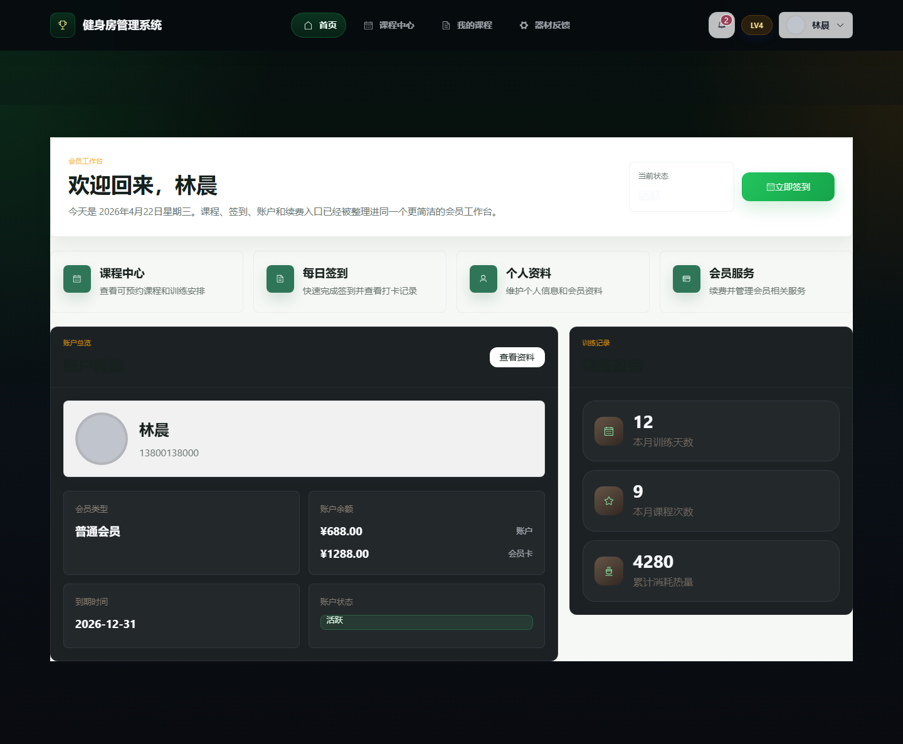
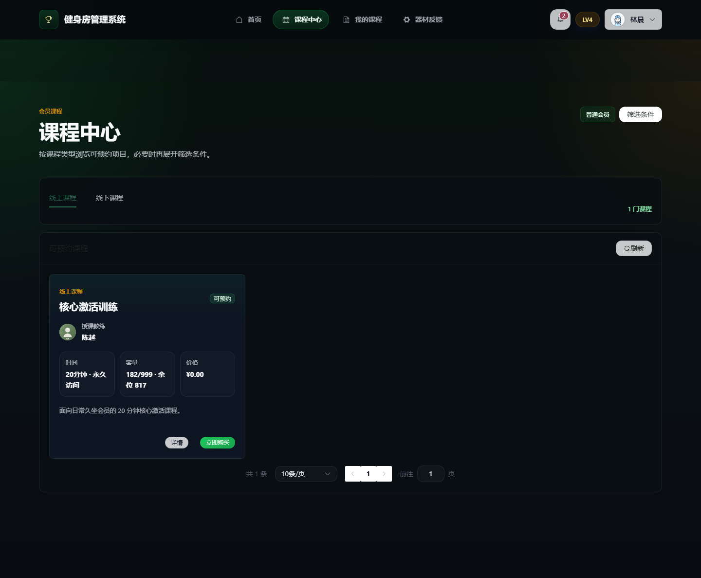
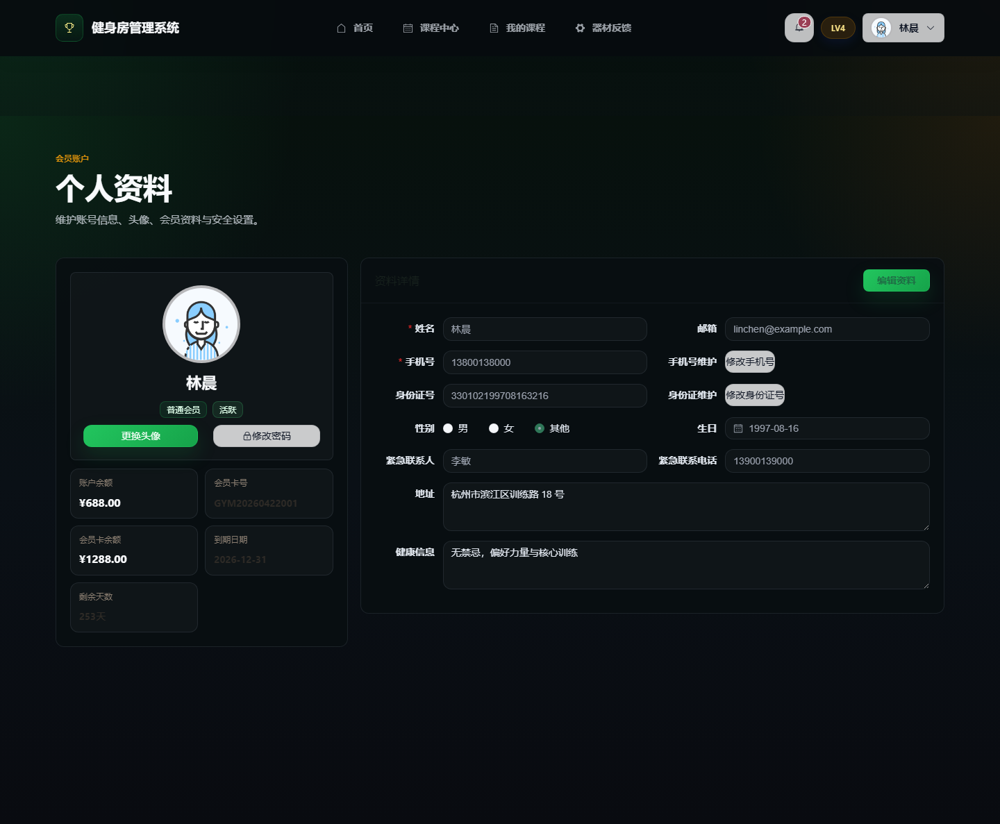
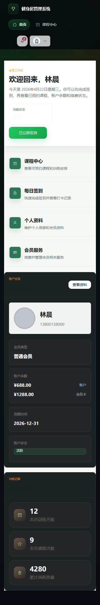
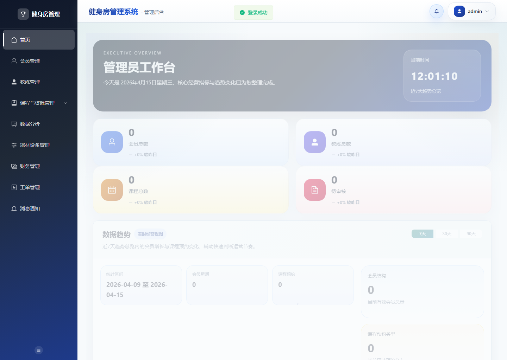
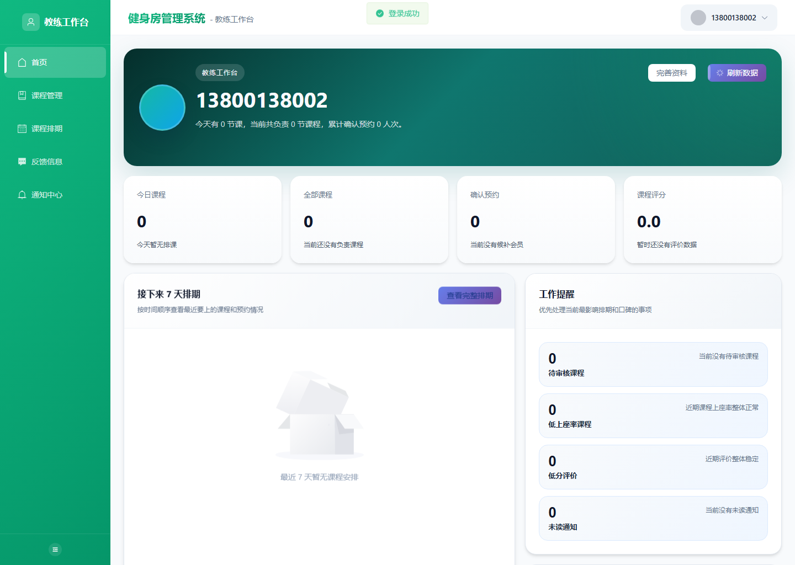
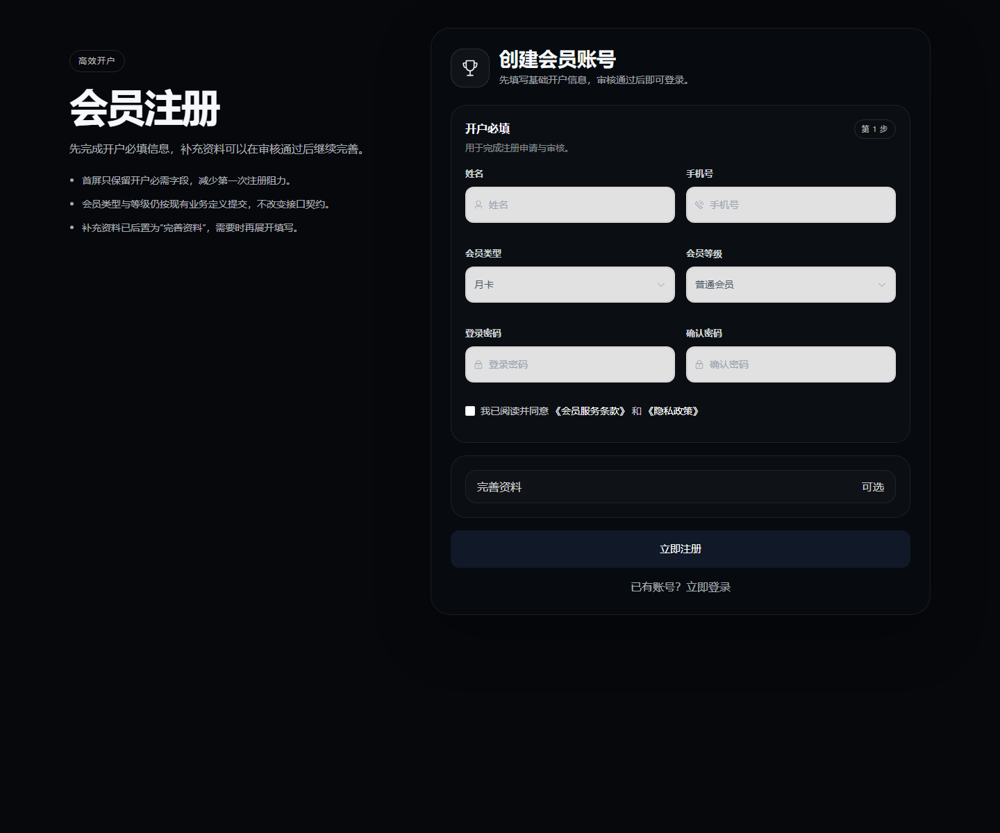

# 健身房管理系统演示

这是一个基于 Spring Boot 3 和 Vue 3 的健身房管理系统演示仓库。本仓库仅用于展示项目页面、业务范围和交互效果，不包含项目源码、数据库脚本、构建产物或敏感配置。

## 项目简介

系统面向健身房日常运营管理，覆盖会员、教练、课程、预约、设备、财务和通知等核心业务场景。前端提供管理员、会员、教练三类角色的独立界面，适合完成会员服务、课程预约、教练排班和后台运营管理等流程。

## 技术栈

- 后端：Spring Boot 3、Spring Cloud、Spring Cloud Gateway、Spring Data JPA、MySQL、Redis
- 前端：Vue 3、TypeScript、Vite、Pinia、Vue Router、Element Plus
- 架构：微服务架构、统一网关入口、前后端分离

## 功能范围

- 用户认证、角色识别和权限控制
- 会员注册、资料维护、签到签退和会员卡服务
- 课程展示、课程预约、候补、签到和反馈评价
- 教练课程管理、排班查看和反馈处理
- 管理端会员、教练、课程、设备、工单、财务和通知管理
- 订单、支付记录、会员余额支付和发票相关流程
- 多端适配，覆盖桌面端和移动端会员体验

## 页面展示

### 登录页

### 会员仪表盘

### 会员课程中心

### 会员资料页

### 会员移动端

### 管理员仪表盘

### 教练仪表盘

### 注册页

## 仓库说明

本仓库只作项目演示介绍使用，不提供源码下载。完整项目包含前后端分离实现、微服务模块、数据库结构和本地运行脚本。
